## Source Paper

This code is the implementation of paper - 

**A Neural Algorithm of Artistic Style** 

[Link to Paper](https://arxiv.org/pdf/1508.06576.pdf)

--------
## Network Details

* Feature Inversion (content generation)
  * Given activations of a particular layer of a given image, generate the original image using gradient ascent
  * MSE loss between activations of original image and input image is used
* Style Transfer (texture generation)
  * Given image activations at different layers, generate the image with similar texture
  * Gram matrix is used for loss calculation
  * MSE loss between gram matrix of style image and input image is used
* Neural Style Transfer
  * Given input image, content image and style image - add content of content image and texture of style image to the input image

---------

## Training Images 

  
   

---------

## Feature Inversion

As we go deeper into the network, quality of regenerated image gets worse. 

  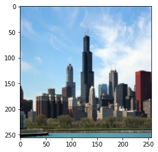
  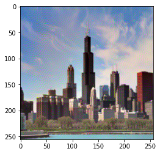 
  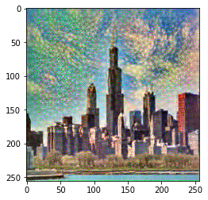
  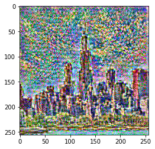

---------
## Content Transfer

Better global texture information is captured in the deeper layers 

  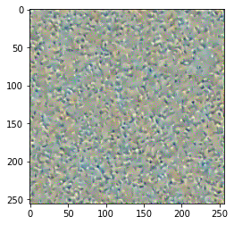
  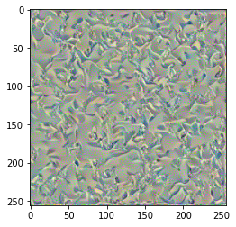 
  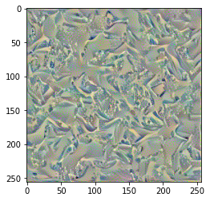
  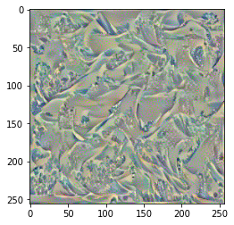

--------
## Generated Images

  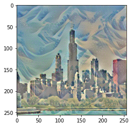
  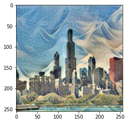 
  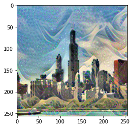

